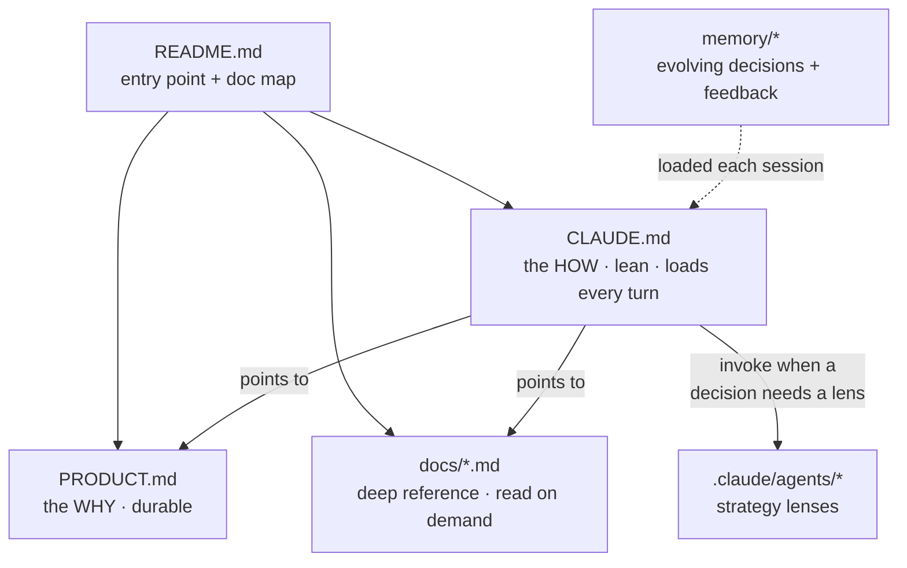
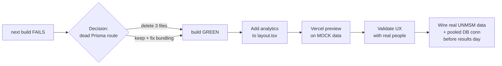

# Heads-up — user research + session handoff (2026-06-10)

This doc has three parts: **(A)** what changed this session and what you should review,
**(B)** the user-research report (durable reference), **(C)** pending decisions & next steps.

---

## A. What I changed this session — review list

I touched **only documentation and strategy files. Zero application code** (`apps/web/src`)
was modified by me — the app changes you see in `git status` predate this session.

> ⚠️ Note: the file you have open in the IDE, `exported-from-claude-conversation.md`,
> was **renamed to `PRODUCT.md`** — that editor tab now points at a moved file.

### Files to review

| File | What I did | Why review |
|---|---|---|
| `CLAUDE.md` | Trimmed **309 → 125 lines**; now leads with a "Prime directive" (ship-first) | Confirm the operational rules still match how you want me to work |
| `PRODUCT.md` | Renamed from the exported brief; added a top "⚠️ SUPERSEDED" banner | Confirm the banner's "current truth" (índigo palette, Next 16/Prisma 7/Postgres, ship-first) is right |
| `README.md` | Fixed stack (15→16), added Testing section + a documentation map | Quick sanity check |
| `docs/scraper.md` | Extracted scraper/portal detail out of CLAUDE.md | Reference only |
| `docs/database.md` | Extracted DB architecture + business rules | Reference only |
| `docs/design-system.md` | Extracted full color tables, fonts, emotional rules | Reference only |
| `docs/screens-and-testing.md` | Screen list, Storybook candidates, test IDs (fixed `/examenes` → `/proximos-examenes`) | Reference only |
| `.claude/agents/{product-strategist,design-critic,architect}.md` | New strategic-lens subagents | Read once; they only activate after a session reload |
| `memory/*` | Added `project_prime_directive`, `project_doc_structure`, `project_user_research_v1` + index | Background context for future sessions |

### New doc structure

---

## B. User-research report

**Method:** deep-research harness — 5 search angles → 18 sources fetched → 77 claims
extracted → 25 verified with 3-vote adversarial verification → **17 confirmed, 8 killed.**

**Bottom line: the product thesis is validated.** The research mostly *confirms* the
direction you already chose, which de-risks shipping rather than triggering a redesign.

### Confirmed findings (high confidence unless noted)

| # | Finding | Product implication |
|---|---|---|
| 1 | **No portal or competitor does individual contextualization.** UNMSM = raw 6-col table; UNI = binary "consulta si lograste tu ingreso"; Ciclero = aggregate-only, no lookup by código/DNI | The whole product wedge is real and unfilled |
| 2 | **Ciclero's headline "puntaje ideal" is the Q3 / 75th percentile — not the real cutoff** | Show the **true nota de corte** + the user's real distance; explicitly differentiate from the "ideal" to out-position Ciclero |
| 3 | Pre-exam dominant query, verbatim: **"¿Cuánto puntaje necesitas para ingresar a [carrera] en San Marcos?"** | Use as the career-stats page H1 / framing, word-for-word |
| 4 | Results-day = **logistics + urgency** ("cómo ver resultados", "resultados UNI en vivo", 6–7 PM window), not analysis | Result page = **fast lookup by código** first; analytics second |
| 5 | Not-admitted emotional cluster: **frustración, tristeza, rabia, vergüenza** ("duelo académico"); injustice peaks **"cuando unas décimas deciden"** | "Te faltaron X puntos" + proximity %; amber never red — confirms existing rules |
| 6 | Validated reframe: alternative careers = **adaptive routes**, never consolation prizes — *"flexibilizar no es rendirse, es adaptarse"* | Frame "Habrías ingresado en…" positively |
| 7 | UNMSM's real **"segunda opción"** rule validates reachable-careers — *and* requires them **grouped by área** (medium confidence) | Group alternatives by the A–E área model (already exists) |

### Caveats — do not over-trust

- **The requested Reddit / TikTok / YouTube verbatim was NOT actually captured.** The
  emotional language came from a Spain clinical-psychology source + Peruvian press —
  *directionally* validated, **not** harvested from the platforms. Treat the Spanish copy
  above as a strong hypothesis; a 30-min manual pass through r/sanmarcos + TikTok would
  confirm real tone.
- **Cutoff numbers drift every cycle** (e.g. Medicina 1224 for 2024-I) — never hard-code.
- **"segunda opción" confirmed for 2024-I/II but NOT for 2026-II**, and it's a
  *pre-declared single* choice, not automatic/retrospective. Frame our reachable-careers
  as an informational *"what-if"*, not a promise of an institutional pathway.
- **8 claims were refuted** — do NOT rely on "easier-to-enter careers", unfilled-vacancy
  counts, or a 900-point floor without re-sourcing.

### Open questions the research left

1. Actual verbatim Spanish phrasing applicants use on social on results day.
2. Whether "segunda opción" persists in the 2026-II reglamento (verify before promising it).
3. What contextualization UNI applicants specifically want (no áreas, 3 cumulative sessions).
4. Search-volume split: pre-exam "puntaje mínimo" vs results-day "en vivo" — to prioritize SEO.

### Key sources

- UNMSM portal: `admision.unmsm.edu.pe/Website20261/A/011/results.html`
- UNI portal: `puntajes.admision.uni.edu.pe/admision/resultados-finales/`
- Ciclero: `ciclero.guru/estadisticas-admision/unmsm/estadistica`
- "Duelo académico" (emotional framing): `quironsalud.com/.../duelo-academico-...`
- UNMSM segunda opción: `elperuano.pe/noticia/224086-admision-san-marcos-habra-segunda-opcion...`

Full structured output (all claims, votes, sources, refuted list) was returned by the
workflow run `wf_f7e67caa-ba0`; key points are also saved in `memory/project_user_research_v1.md`.

---

## C. Pending decisions & next steps

The architect lens reviewed the uncommitted Phase-1 build. **Verdict: NO-SHIP as-is —
one trivial build blocker, but the foundation is genuinely good and appropriately thin.**

### Ship-readiness path

### Your pending decisions (in priority order)

1. **Dead Prisma route chain** — `app/api/universities/route.ts`, `services/university.service.ts`,
   `repositories/university.repository.ts`. These break `next build`, are unused, and are
   off-spec (search is Phase 2; the `repositories/services` layer isn't in the documented
   architecture). **Decide:** delete now (recommended — recoverable via git), or keep and
   fix Prisma-7 + pnpm + Next bundling. *(You asked to review this yourself first.)*
2. **Analytics** — there is currently **none** in the repo. The "instrument" half of the
   prime directive is unmet. Simplest thin-ship option: `@vercel/analytics`. **Decide:**
   Vercel Analytics vs PostHog vs GA4.
3. **Commit strategy** — there's a large uncommitted Phase-1 build (result + process pages,
   components, Playwright) **plus** these new docs, and the local branch is **14 commits
   ahead of origin** (nothing pushed). **Decide:** how to group/commit, and when to push.
4. **Mock vs real data for first deploy** — Phase-1 pages run on `MOCK_*` data
   (`getResultData.ts:50+`). A preview validates the *experience* but not the *data
   pipeline*. **Decide:** ship on mock to validate UX now, vs wait for real data.
5. **Route name** — calendar lives at `/proximos-examenes` (matches PRODUCT.md); old
   CLAUDE.md said `/examenes`. Already fixed in docs; **confirm** the route name is final.

### When you wire real data (not this week — just noting)

- **Do NOT** `generateStaticParams` over ~26k applicant codes (slow builds, page bloat).
  Keep the applicant route **dynamic with `revalidate`** — data changes only 2–3×/year.
- **Use a pooled Postgres connection** (PgBouncer / Neon pooled URL / Prisma Accelerate) —
  Vercel functions open a connection per invocation (the classic serverless+Prisma footgun).

### Suggested sequence

1. You review the dead-route files → tell me delete vs keep.
2. I make the agreed fix(es) + add analytics → verify `next build` passes.
3. Commit in logical chunks (docs / build fix / analytics).
4. Deploy a Vercel preview on mock data; look at it on mobile.
5. Later: validate copy against real social language; wire real UNMSM data before results day.
</content>
