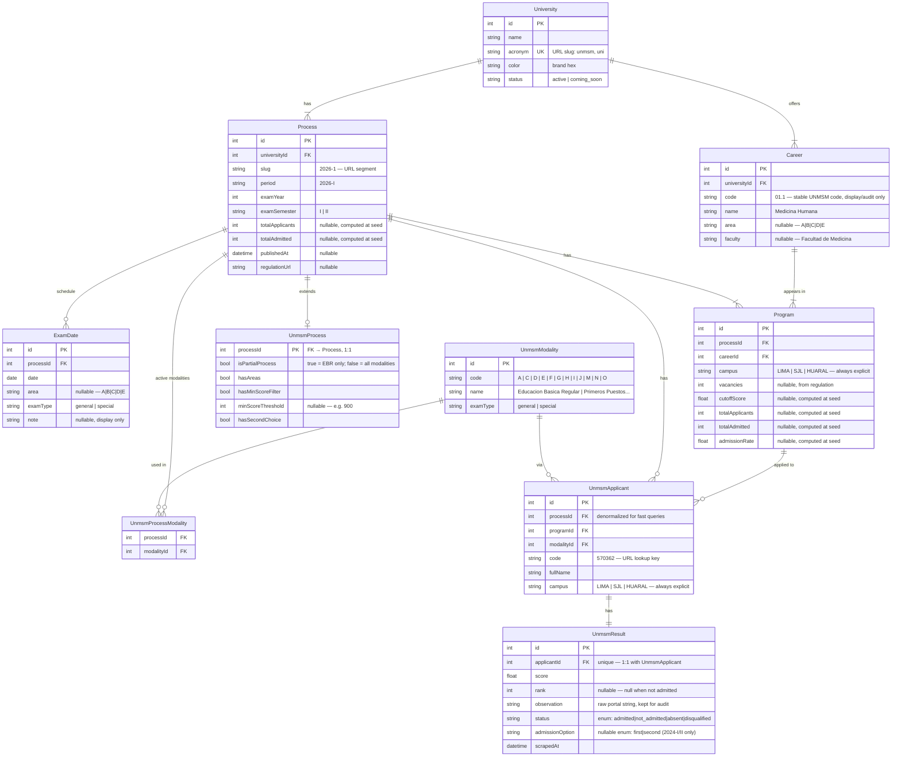

# DB Schema Proposal — admitidos.pe (v4)

## Design principles

1. **Shared spine** — `University → Career → Process → Program` + `ExamDate` are universal.
2. **University-prefixed tables** — all UNMSM-specific tables carry the `Unmsm` prefix. When UNI lands, its tables carry `Uni`. No ambiguity at a glance.
3. **1:1 process extension** — `UnmsmProcess` adds UNMSM rule flags to `Process` without polluting the shared table with nullable university-specific columns.
4. **No JSON columns** — every queryable field is a typed column.
5. **Postgres enums for finite status sets** — `ApplicantStatus` and `AdmissionOption` are enums. Translation to Spanish happens in the presentation layer only.
6. **Stats computed at seed** — `cutoffScore`, `totalApplicants`, `totalAdmitted`, `admissionRate` materialized at seed time; pages never run aggregation queries.
7. **`campus` always explicit** — `"LIMA"` is stored, never implied by a null.
8. **Int PKs everywhere** — all surrogate PKs are `int` for fast joins. Human-readable codes (acronym, slug, applicant code) are separate columns.

---

## Enums (Postgres / Prisma)

```
enum ApplicantStatus {
  admitted
  not_admitted
  absent
  disqualified
}

enum AdmissionOption {
  first
  second
}
```

`UnmsmResult.status`         → `ApplicantStatus` (always set)
`UnmsmResult.admissionOption` → `AdmissionOption?` (null = standard admission, no second choice)

---

## ER Diagram



---

## Unique constraints

| Table | Constraint | Reason |
|---|---|---|
| `University` | `acronym` | URL slug |
| `Career` | `(universityId, code)` | One career per code per university |
| `Process` | `(universityId, slug)` | One slug per university |
| `Program` | `(processId, careerId, campus)` | Same career at multiple campuses |
| `UnmsmModality` | `code` | One entry per modality code |
| `UnmsmProcessModality` | `(processId, modalityId)` | Composite PK |
| `UnmsmApplicant` | `(processId, code)` | One result per code per process |
| `UnmsmResult` | `applicantId` | 1:1 |

---

## Key indexes

| Table | Index | Powers |
|---|---|---|
| `UnmsmApplicant` | `(processId, code)` | Individual result page lookup `/unmsm/2026-1/applicant/570362` |
| `UnmsmApplicant` | `programId` | Program applicant list + percentile |
| `UnmsmResult` | `score` | Position bar, percentile |
| `Program` | `(processId, careerId)` | Program detail page |
| `Career` | `(universityId, area)` | Area listing page |
| `Career` | `code` | Cross-process historical cutoff chart |

---

## Design decisions

### `Career` — master program catalog
Holds the stable identity of each academic program independent of any admission cycle.
`Program` rows reference `Career` via FK — the career's name, area, and faculty never
need to be repeated per process. Cross-process cutoff history:
```sql
SELECT p.cutoffScore, pr.period
FROM programs p
JOIN processes pr ON p.processId = pr.id
JOIN careers c ON p.careerId = c.id
WHERE c.universityId = 1 AND c.code = '01.1'
ORDER BY pr.examYear, pr.examSemester
```

### Campus-career relationship — no `UnmsmCampus` table needed
The campus-career mapping is already implicit in `Program`: each row encodes
(career, campus, process). To know which campuses cover which careers for the
latest process:
```sql
SELECT DISTINCT p.campus, c.name
FROM programs p JOIN careers c ON p.careerId = c.id
WHERE p.processId = :latest_process
ORDER BY p.campus, c.name
```
A separate `UnmsmCampus` table would only be needed if campus-level metadata
(address, map link) is required — not in Phase 1.

### `campus` always explicit
`"LIMA"` is always stored. No implicit meaning from null. Null would mean "unknown",
which is a different thing and should never happen after a clean seed.

### `UnmsmModality` — no `universityId` FK
Dropping the `universityId` column since the table name already scopes it to UNMSM.
When UNI is added, a separate `UniModality` table is created.

### `ApplicantStatus` as Postgres enum
`admitted | not_admitted | absent | disqualified` are finite and stable.
Postgres enforces the constraint at the DB level. The presentation layer maps to
Spanish: `"Admitido"`, `"No admitido"`, `"Ausente"`, `"Anulado"`.

### `AdmissionOption` as nullable Postgres enum
`first | second` — null means "standard admission" (no second-choice context).
Only 2024-I and 2024-II ever populate this field (549 rows in 2024-II, 303 in 2024-I).

### `observation` kept as raw string
The raw portal value (`"ALCANZO VACANTE SEGUNDA OPCIÓN"`, `"AUSENTE"`, etc.)
is stored alongside the normalized `status` enum for audit and future re-derivation.

### `status` derivation at seed time

| Raw `observation` | `status` | `admissionOption` |
|---|---|---|
| starts with `ALCANZO/Ó VACANTE` (no suffix) | `admitted` | `null` |
| `ALCANZO VACANTE PRIMERA OPCIÓN` | `admitted` | `first` |
| `ALCANZO VACANTE SEGUNDA OPCIÓN` | `admitted` | `second` |
| `AUSENTE` | `absent` | `null` |
| `ANULADO` | `disqualified` | `null` |
| empty | `not_admitted` | `null` |
